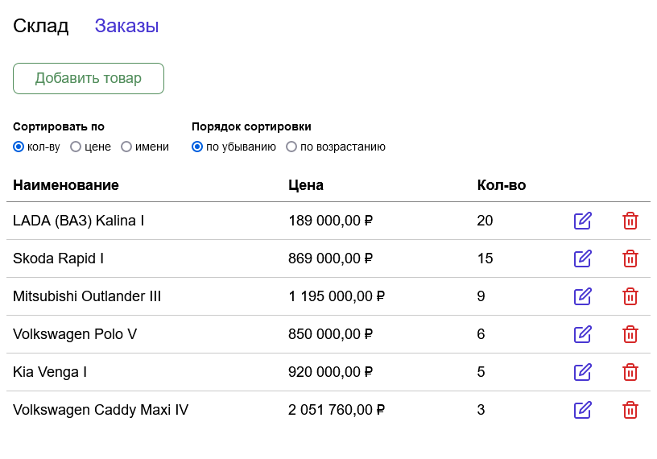

# Склад

Проект создан с помощью [Create React App](https://github.com/facebook/create-react-app), с [Redux](https://redux.js.org/), [Redux Toolkit](https://redux-toolkit.js.org/) и TypeScript. 

[Посмотреть вживую](http://stock.staskozin.ru/)

## Задача

Программа содержит список товаров на складе. Список имеет следующую структуру: наименование товара, количество товара в штуках, стоимость единицы товара. Программа должна заполнить список и вывести его на экран в виде таблицы, а затем при вводе наименования товара и требуемого количества товара вывести на экран сообщение о стоимости заказываемого товара и уменьшить общее количество данного товара на складе. Отсортируйте список по полю «наименование товара».

## Доступные команды

### `npm start`

Запускает приложение в режиме разработки.
Откройте [http://localhost:3000](http://localhost:3000), чтобы увидеть в браузере.

### `npm run build`

Собирает приложение для продакшена в папку `build`.
Он собирает React в режиме продакшена и оптимизирует сборку для лучшей производительности.
